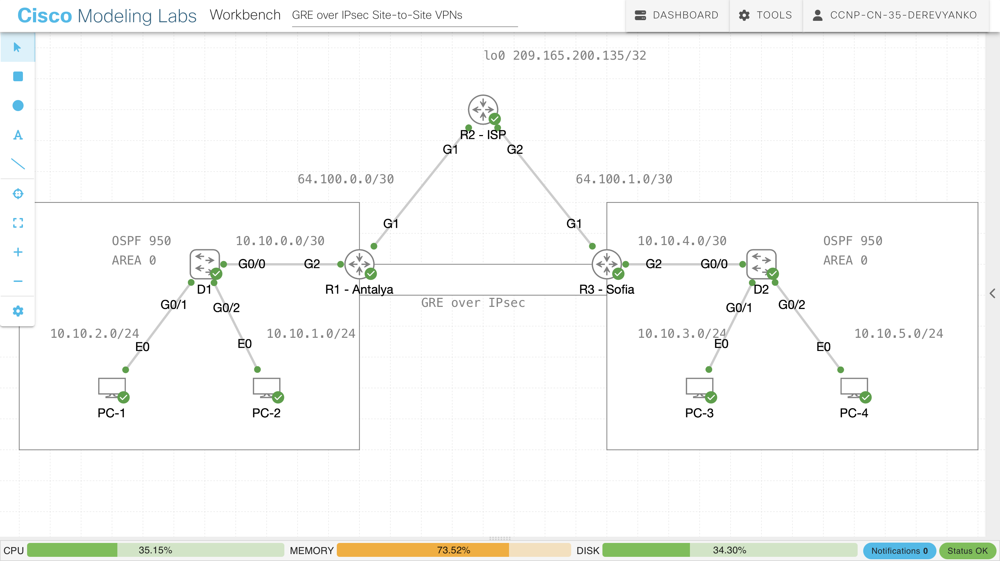

# GRE-over-IPsec-Site-to-Site-VPNs

📖 Overview
This lab demonstrates how to build a site-to-site VPN using GRE over IPsec between two remote sites across an ISP network.
Dynamic routing is implemented using Open Shortest Path First to advertise internal networks across the tunnel.
The topology simulates two enterprise locations connected through a service provider.

Components
Device	Role
D1	Distribution switch / L3 gateway (Site A)
R1 – Antalya	Edge router (Site A)
R2 – ISP	Service provider router
R3 – Sofia	Edge router (Site B)
D2	Distribution switch / L3 gateway (Site B)
PC1 / PC2	Clients in Site A
PC3 / PC4	Clients in Site B

🌐 Network Addressing
Site A
Network	Description
10.10.1.0/24	PC2 LAN
10.10.2.0/24	PC1 LAN
10.10.0.0/30	D1 ↔ R1
Site B
Network	Description
10.10.3.0/24	PC3 LAN
10.10.5.0/24	PC4 LAN
10.10.4.0/30	R3 ↔ D2
ISP Links
Network	Description
64.100.0.0/30	R1 ↔ R2
64.100.1.0/30	R2 ↔ R3
GRE Tunnel
Network	Description
172.16.1.0/30	GRE tunnel network

🔄 Traffic Flow
Example: PC1 → PC4
PC1
 ↓
D1
 ↓
R1
 ↓
GRE Tunnel
 ↓
IPsec Encryption
 ↓
ISP (R2)
 ↓
R3
 ↓
D2
 ↓
PC4

# 🔐 GRE over IPsec Site-to-Site VPN Lab

---

## 📚 Overview

This lab demonstrates how to build a **Site-to-Site VPN using GRE over IPsec** between two remote enterprise sites connected through an ISP network.

The tunnel allows dynamic routing using **OSPF**, enabling internal networks to be advertised securely across the VPN.

The topology simulates a real-world enterprise architecture with encrypted communication over an untrusted service provider network.

---

## 🗺️ Topology

---

## 🧱 Lab Components

| Device | Role |
|------|------|
| **D1** | Distribution Switch / L3 Gateway (Site A) |
| **R1 – Antalya** | Edge Router (Site A) |
| **R2 – ISP** | Service Provider Router |
| **R3 – Sofia** | Edge Router (Site B) |
| **D2** | Distribution Switch / L3 Gateway (Site B) |
| **PC1 / PC2** | Clients in Site A |
| **PC3 / PC4** | Clients in Site B |

---

# 🌐 Network Addressing

## Site A

| Network | Description |
|------|------|
| 10.10.1.0/24 | PC2 LAN |
| 10.10.2.0/24 | PC1 LAN |
| 10.10.0.0/30 | D1 ↔ R1 |

---

## Site B

| Network | Description |
|------|------|
| 10.10.3.0/24 | PC3 LAN |
| 10.10.5.0/24 | PC4 LAN |
| 10.10.4.0/30 | R3 ↔ D2 |

---

## ISP Links

| Network | Description |
|------|------|
| 64.100.0.0/30 | R1 ↔ R2 |
| 64.100.1.0/30 | R2 ↔ R3 |

---

## GRE Tunnel Network

| Network |
|------|
| 172.16.1.0/30 |

---

# 🔐 VPN Architecture

The solution uses a **layered VPN design**.

